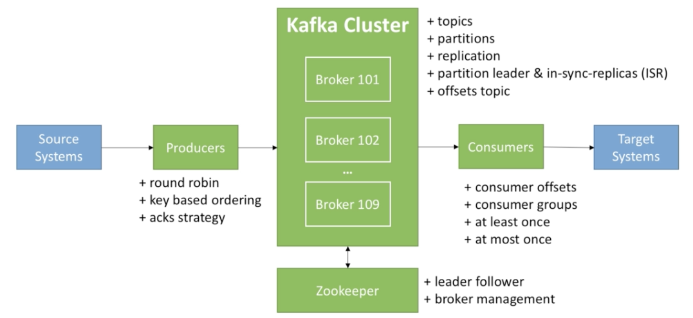

# Apache Kafka Series - Learn Apache Kafka for Beginners

Tags: java
URL: https://www.udemy.com/course/apache-kafka/

# Introduction

 Kafka works as a mechanism to move data between applications!

# Kafka Fundamentals



## Topic

A particular stream of data. It's equivalent to a table in a relational database, you can have many as you want and it is identified by its name.

A topic is split in partitions, each one is ordered and each message inside a partition gets an incremental id called offset.

When you create a topic it's necessary to indicate how many partitions it will be have.


- Offset only have a meaning for a specific partition
- Order is guaranteed only within a partition.
- Data is kept only for a limited time.
- Immutability, once data is written to a partition, it can't be deleted.
- Data is assigned to a partition unless a key is provided.

## Broker

Each broker is a server, a Kafka cluster is composed of multiple brokers, each broker is identified with its ID (integer). 

After connecting to any broker you'll be connected to the entire cluster, that is called bootstrap broker. The clusters could have over 100 brokers.

When you create a topic in Kafka, it will spread and distribute the partitions over the entire brokers in the cluster.


## Topic Replication Factor

Topics have a replication factor, (at start it's 1), usually between 2 and 3. It means the number of times that the partition is replicated through the brokers.


At any time only ONE broker could be a leader of a given partition, only the leader can receive and serve data for a partition, the other partitions in other brokers will synchronize the data. Zookeeper is the responsible to determine the leader, change the leader in case of a broker fails and restore the leader when the broker has been restored.


## Producers

Producers write data to topics, it automatically knows to which broker and partition to write, producers has been implemented with recovery in case of Broker failures. The data is sent from the producer to Brokers using round-robin balance.

There are 3 types of acknowledgement of data writes:

- ack=0, no wait for acknowledgement (possible data loss)
- ack=1, default, leader acknowledgement (limited data loss)
- ack=all, leader and replicas acknowledgement (no data loss)


Producers can send choose to send a key with message. If the key is null, the data will be send to the Kafka cluster using a round-robin strategy thought the multiple brokers. If a key is sent, all the messages with the same key will always go to the same partition. A key must be sent if you need messaging ordering for a specific field.

We get this thanks to the key hashing, which depends of the number of partitions.


## Consumers

The consumer read data from a topic identified by name, they know from which broker to read from and in case of broker failure they are capable to recover. Data is read in order within each partition and a consumer can read data from different brokers and partitions parallel, so there is not guarantee of order between partitions.


### Consumer Groups

Consumers read data in consumer groups, each consumer within a group reads from exclusive partitions. If exist more consumers than partitions some of the consumers will be inactive, this is desirable to ensure high-availability from consumers side, but it is the only case. Consumers automatically use a GroupCoordinator and ConsumerCoordinator to assign consumers to a partition.


## Consumer Offsets

- Kafka stores the offsets (in a topic called __consumer_offsets) at which a consumer group has been reading. When a consumer in a group has processed data received from Kafka, it should committing the offsets, so if a consumer dies, it will be able to read back from where it left off thanks to the committed consumer offsets.


## Delivery Semantics for Consumer

Consumer can choose when to commit offsets:

- **At most once:** Offsets are committed at soon as the message is received, if the processing goes wrong, the message will be lost because the message will not be read again.
- **Al least once:** Offsets are committed after the message is processed, if the processing goes wrong the message will be read again, due this, the processing app should be idempotent, process the same message twice and deliver the same result.
- **Exactly once:** Used by Kafta-to-Kafka (using Kafka Streams API) and Kafta-to-ExternalSystems workflows (ensure to use an idempotent consumer).

## Kafka Broker Discovery

Every broker in Kafka is also called bootstrap server, that means that you only need to connect to one broker, and you'll be connected to the entire cluster, because each broker has some metadata and knows about all brokers, topics and partitions.


## Zokeeper

- Manages brokers.
- Helps in performing leader election for partitions.
- Sends notifications to Kafka in case of changes (topic created, broker dies etc...)
- Kafka can't work without Zookeeper
- By design operates with an odd number of servers
- Has a leader (handle writes) the rest of servers are followers (handle reads).
- Does NOT store consumer offsets


# Starting Kafka

1. Ensure change the Zookeeper and Kafka directories to no loss data.
2. Start Zookeeper.
3. Start Kafka.

```bash
zookeeper-server-start.sh config/zookeeper.properties
kafka-server-start.sh config/server.properties
```

# Command Line Interface 101

## Topics CLI

In Kafka you can not create a topic with a replication factor greater than the numbers of brokers you have.

```bash
kafka-topics.sh --zookeeper 127.0.0.1:2181 --topic first_topic --create --partitions 3 --replication-factor 1
kafka-topics.sh --zookeeper 127.0.0.1:2181 --topic first_topic --describe
kafka-topics.sh --zookeeper 127.0.0.1:2181 --topic second_topic --delete
```

## Producer CLI

The broker-list and topic are required parameters.

```bash
kafka-console-producer.sh --bootstrap-server 127.0.0.1:9092 --topic first_topic
```

If a topic not exists a warning message will said that NO_LEADER was found for that topic, it is because Kafka producer will create a topic with the defaults values of 1 for replication factor and partitions in case of the topic not exists, after than, the producer will retry to produce the event. Try to always create the topic beforehand, if you wish the defaults values can be changed in the [server.properties](http://server.properties) file.

### Producer with Keys

It is possible to produce events with specifying a key.

```bash
kafka-console-producer.sh --bootstrap-server 127.0.0.1:9092 --topic first_topic --property parse.key=true --property key.separator=,
> key,value
> another key,another value
```

## Consumer CLI

 The console consumer does not read the old messages, only read the messages that are created since the consumer connection is stablished.

```bash
kafka-console-consumer.sh --bootstrap-server 127.0.0.1:9092 --topic first_topic
```

The messages could be read from the beginning using the flag `—fom-beginnig` .

### Consumer with Keys

Also will be possible to consume using keys.

```bash
kafka-console-consumer.sh --bootstrap-server 127.0.0.1:9092 --topic first_topic --from-beginning --property print.key=true --property key.separator=,
```

## Consumer Groups CLI

When you create a consumer, you can specify a consumer group using the flag `—group` , it means that all the messages sent to the topic where exists multiple consumers that are part of the same group will be balanced and distributed equally between them.

```bash
kafka-console-consumer.sh --bootstrap-server 127.0.0.1:9092 --topic first_topic --group first_group
```

When the group is specified, Kafka record the offsets of the messages that are delivered to the group. For that reason if you stop the consumer and restart again, the consumer will not be able to read the messages from the beginning despite of the flag is specified, this is because the previous messages are received acknowledgment so Kafka will only sent messages with a greater offset. 

When you use a Console Consumer and the consumer group is not specified, a new random group identified by a random number is created.

```bash
kafka-consumer-groups.sh --bootstrap-server 127.0.0.1:9092 --list
```

It is possible to describe a group and fetch information about the current offset, the log end offset and the lad difference. On the other hand is possible to see all the active consumers in that group identified by id and host.

```bash
kafka-consumer-groups.sh --bootstrap-server 127.0.0.1:9092 --describe --group first_group
```

### Resetting Offsets

It's possible to restart the partition offsets of a topic for a specific consumer group, there are many options as reseting to the earliest, by date time, etc. It will not be possible to reset the offsets if exists active consumers attached to the group.

```bash
kafka-consumer-groups.sh --bootstrap-server 127.0.0.1:9092 --group first_group --reset-offsets --to-earliest --execute --topic first_topic
```

# Kafka Java Programming 101

[daprieto1/AKS-LearnApacheKafkaForBeginners](https://github.com/daprieto1/AKS-LearnApacheKafkaForBeginners)

- Don't block producer with `send().get()`
- Producing with a key allows to ensure the messages that have the same keys go to the same partition.
- If I produce without a key, the messages will be sent to all partitions in a round-robin fashion.
- To allows consumers in a group to resume at the right offset, I need to set `group.id`
- If a consumer joins or leaves a group, a rebalance happens to assign partitions to all consumers.
- We usually use .assign() and .seek() for replay capability at certain offset.
- There is bi-directional compatibility between Kafka versions and Kafka clients, but try to use the latest versions in any end.

# Kafka Twitter Producer and Advanced Configurations

**Twitter Client**

[twitter/hbc](https://github.com/twitter/hbc)

**Kafka Project**

[daprieto1/AKS-LearnApacheKafkaForBeginners](https://github.com/daprieto1/AKS-LearnApacheKafkaForBeginners/tree/master/src/main/java/com/daprieto1/kafka/tutorial2)

## Producer Acks Deep Dive

### Acks = 0

No response is requested from the broker, so if the broker goes offline or an exception happens, we will not know and will lose data. Useful for data where it's fine to potentially lose messages as metric or log collection.

The best performance is this because the producer will not wait for any confirmation.


### Acks = 1 (Default)

Leader response is requested, but replication is not guarantee, this happens in background. If an acknowledgement is not received, the producer could retry without duplicate data. If the leader broker goes offline but replicas haven't replicated the data yet, we have data lost.


### Acks = all

The leader and the replicas are requested by acknowledgement, this means that the producer has to wait to receive confirmation of any replica of the broker before to continue, this add latency but ensures safety, this setting ensure no lose data.


This configuration must be used in conjunction with `min.insync.replicas` , this setting can be set at broker or topic level overriding the broker value. That means if you use `replication.factor=3` with `min.insync.replicas=2` and `acks=all` , you can only tolerate 1 broker going down, otherwise the producer will receive an exception on send. If there are not enough replicas up available to write data, an exception will be returned `NOT_ENOUGH_REPLICAS` and is responsibility of the producer retry until a successful result.


## Producer Retries

In case of transient failures Kafka Producer will automatically retry with the following settings:

- `retries` Default value could be 0 for kafka ≤ 2.0 or Integer.MAX for kafka >2.1
- `retry.backoff.ms` by default is 100 ms and is the time that Kafka Producer will wait until retry again.
- `delivery.timeouts.ms` by default is 120000 ms or 2 minutes, if the message is not delivered under that time, the Kafka Producer will not retry anymore and the exception need to be handle in the callback. This avoid to retry forever.

In case of retry there is a chance that messages will be sent out of order, so if you rely on key-based ordering, that can be an issue. If you need ensure ordering you could change the value of `max.in.flight.requests.per.connection` that by default is 5 and controls how many produce requests can be made in parallel, you could set to 1, but this will impact the performance and the throughput!.

## Idempotent Producer

It is possible that some produce requests acknowledgements will be lost because network problems, if that happens a no necessary retry could occurs producing duplicated data. 


With the Idempotent Producers, each produce request is identified by an id, so Kafka will be capable to detect a deduplication and avoid write the data twice, but return an acknowledge to confirm the commit of the request. 


```java
producerProperties.put("enable.idempotence", true);
```

## Message Compression

[Squeezing the firehose: getting the most from Kafka compression](https://blog.cloudflare.com/squeezing-the-firehose/)

Using the setting `compression.type` you could define the compression tool, this is effective in terms of bandwidth, CPU, memory and time consuming. To improve the throughput is good idea tweaking the settings `linger.ms` and `batch.size` to have bigger batches, and therefore more compression and higher throughput.


## Producer Batching